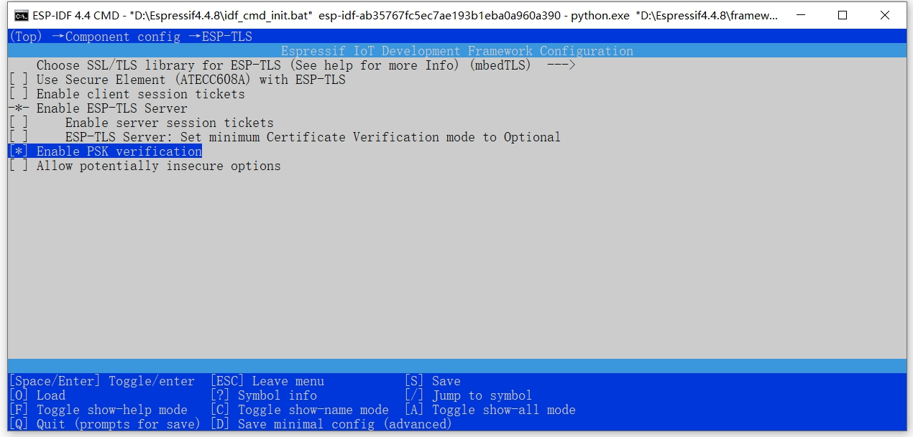
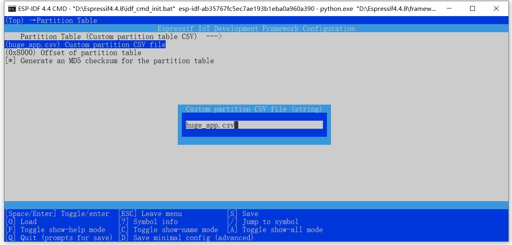

如果出现ssl相关的编译错误，可启用PSK verification，方法如下  
idf.py menuconfig 进入配置页面，如如下路径选择：  
Component config -> ESP-TLS -> Enable PSK verification  
  

默认的分区可能无法支持启用PSK verification后的固件大小，可手动修改分区。  
将components\arduino\tools\partitions\huge_app.csv拷贝到项目根目录下。  
idf.py menuconfig 进入配置页面，如如下路径选择：  
Partition Table -> Partition Table -> Custom partition table CSV  
然后返回上一层目录选择 Custom partition CSV file，在弹出对话框中填入：huge_app.csv  
  

然后修改Flash尺寸为4M（按开发板实际情况填写，一般买到的都是4M版本，默认是2M，在使用huge_app.csv分区后，需有手工修改为4M）  
idf.py menuconfig 进入配置页面，如如下路径选择：  
Serial flasher config -> Flash size -> 4M  

